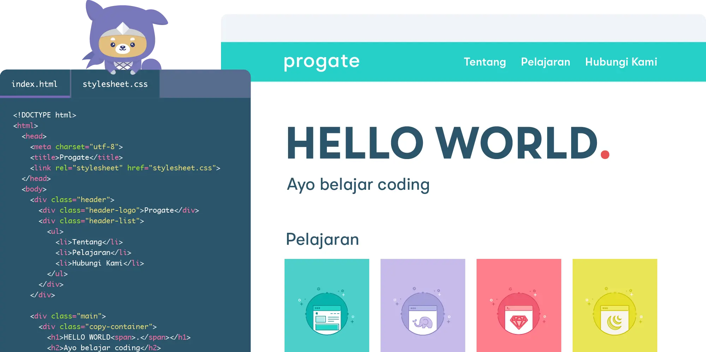
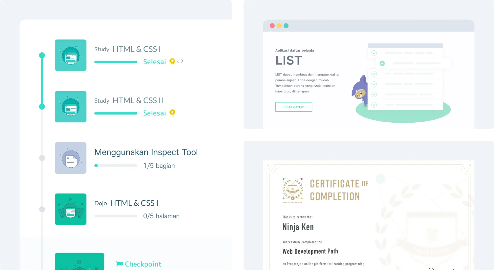

 

  

 

  <a href="https://progate.com/">Progate</a> adalah platform pembelajaran pemrograman secara online dalam bahasa Indonesia dan Inggris. Dengan Progate kamu dapat belajar programming secara mandiri dan terstruktur.

  Progate menawarkan platform yang sangat intuitif untuk belajar coding. Antarmuka dari platform yang sangat interaktif dan juga materi yang disusun secara terstruktur, membuat pengalaman belajar menjadi makin asyik dan mudah untuk dimengerti.

  Selain itu, biaya berlangganan yang sangat terjangkau merupakan sebuah nilai tambah. Belajar coding tidak hanya berguna untuk mereka yang mengejar karir sebagai software developer, tetapi juga membantu orang untuk mengasah kreativitas, pemikiran logis, dan kemampuan untuk memecahkan masalah secara mandiri.

 

---

<!-- # Learn -->

<h1 align="center">Daftar Bahasa</h1>

## HTML & CSS  [[📂]()] [[🔍](https://progate.com/courses/html)] [[📃](https://d2w8fsc1wkigu3.cloudfront.net/1600859/4e5c1753554afc72d8590a19d677f977/certificates/courses/0efd23d0b98c48028c2eac92db8c1e7ccourse_certificate_0cbd1611qsgn3h.pdf)]

Daftar Bab

### HTML & CSS I

Daftar Materi

- Memulai dengan HTML

- Memulai dengan CSS

- Layout (Tata Letak) Dasar

- Header

- Footer

- Konten

- Formulir

### HTML & CSS II

Daftar Materi

- Layout (Tata Letak) Dasar

- Bagian Atas Halaman

- Header

- Daftar Pelajaran

- Bagian Pesan

- Footer

- Memperbaiki Header

### HTML & CSS III

Daftar Materi

- Desain Web yang Responsive

- Media Queries

- Menjadikan Halaman Anda Responsive

### HTML & CSS Flexbox

Daftar Materi

- Apa itu Flexbox?

- Mengimplementasikan Flexbox

- Desain Responsive

Daftar Latihan

### HTML & CSS I

Membuat halaman web dari awal

- Header
- Bagian Atas Halaman
- Bagian Konten atau Isi
- Bagian Formulir
- Footer

### HTML & CSS II

Membuat halaman web modern dari awal

- Bagian Atas
- Header
- Daftar Pelajaran
- Bagian Pesan
- Footer

### HTML & CSS III

Menguasai Desain Web yang Responsive

- Menjadikan Header Responsive
- Menjadikan Bagian Atas Responsive
- Menjadikan Daftar Pelajaran Responsive
- Menjadikan Footer Responsive

