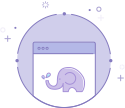
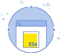
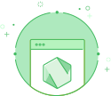
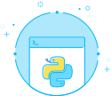
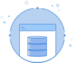
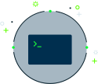

 

  

 

  <a href="https://progate.com/">Progate</a> adalah platform pembelajaran pemrograman secara online dalam bahasa Indonesia dan Inggris. Dengan Progate kamu dapat belajar programming secara mandiri dan terstruktur.

  Progate menawarkan platform yang sangat intuitif untuk belajar coding. Antarmuka dari platform yang sangat interaktif dan juga materi yang disusun secara terstruktur, membuat pengalaman belajar menjadi makin asyik dan mudah untuk dimengerti.

  Selain itu, biaya berlangganan yang sangat terjangkau merupakan sebuah nilai tambah. Belajar coding tidak hanya berguna untuk mereka yang mengejar karir sebagai software developer, tetapi juga membantu orang untuk mengasah kreativitas, pemikiran logis, dan kemampuan untuk memecahkan masalah secara mandiri.

 

---

<!-- # Learn -->

<h1 align="center">Daftar Bahasa</h1>

## HTML & CSS  [[📂]()] [[🔍](https://progate.com/courses/html)] [[📃](https://d2w8fsc1wkigu3.cloudfront.net/1600859/4e5c1753554afc72d8590a19d677f977/certificates/courses/0efd23d0b98c48028c2eac92db8c1e7ccourse_certificate_0cbd1611qsgn3h.pdf)]

Daftar Bab

### HTML & CSS I

Daftar Materi

- Memulai dengan HTML

- Memulai dengan CSS

- Layout (Tata Letak) Dasar

- Header

- Footer

- Konten

- Formulir

### HTML & CSS II

Daftar Materi

- Layout (Tata Letak) Dasar

- Bagian Atas Halaman

- Header

- Daftar Pelajaran

- Bagian Pesan

- Footer

- Memperbaiki Header

### HTML & CSS III

Daftar Materi

- Desain Web yang Responsive

- Media Queries

- Menjadikan Halaman Anda Responsive

### HTML & CSS Flexbox

Daftar Materi

- Apa itu Flexbox?

- Mengimplementasikan Flexbox

- Desain Responsive

Daftar Latihan

### HTML & CSS I

Membuat halaman web dari awal

- Header
- Bagian Atas Halaman
- Bagian Konten atau Isi
- Bagian Formulir
- Footer

### HTML & CSS II

Membuat halaman web modern dari awal

- Bagian Atas
- Header
- Daftar Pelajaran
- Bagian Pesan
- Footer

### HTML & CSS III

Menguasai Desain Web yang Responsive

- Menjadikan Header Responsive
- Menjadikan Bagian Atas Responsive
- Menjadikan Daftar Pelajaran Responsive
- Menjadikan Footer Responsive

## Sass  [[📂]()] [[🔍](https://progate.com/courses/sass)] [[📃](https://d2w8fsc1wkigu3.cloudfront.net/1600859/4e5c1753554afc72d8590a19d677f977/certificates/courses/7fb8f814c524b0ace63dbf6e9028c2eccourse_certificate_916987b4qshxj7.pdf)]

Daftar Bab

### Sass I

Daftar Materi

- Fundamental Sass

- Halaman Sass Pertama Anda

Daftar Latihan

Belum Ada

## PHP  [[📂]()] [[🔍](https://progate.com/courses/php)] [[📃](https://d2w8fsc1wkigu3.cloudfront.net/1600859/4e5c1753554afc72d8590a19d677f977/certificates/courses/d4733852f6d5ff6f0783afa3a52d4dbbcourse_certificate_9e566549qshwo0.pdf)]

Daftar Bab

### PHP I

Daftar Materi

- Apa itu PHP?

- Dasar-Dasar PHP

- Statement Kondisional

- Menggunakan Array

- Loop

- Menggunakan Function

- Membuat Formulir Kontak

### PHP II

Daftar Materi

- Object-Oriented Programming

- Bergerak Menuju Tujuan

- Enkapsulasi

- Menyelesaikan Layanan Web

### PHP III

Daftar Materi

- Object-Oriented Programming

- Inheritance

### PHP IV

Daftar Materi

- Membuat Halaman Detail

- Menambah Pengguna

Daftar Latihan

### PHP I

Menguasai Dasar PHP

- Menampilkan String

- Menggabungkan String

- Kalkulasi

- Statement Kondisional

- FizzBuzz

Menguasai Array

- Menghitung Total Harga

- Harga Maksimal

Array Associative

- Menampilkan Harga

- Menampilkan Semua Harga

- Total Jumlah

- Barang Termahal

## JavaScript  [[📂]()] [[🔍](https://progate.com/courses/es6)] [[📃](https://d2w8fsc1wkigu3.cloudfront.net/1600859/4e5c1753554afc72d8590a19d677f977/certificates/courses/fcbf6033a66096c762a3c0f3a935c8b1course_certificate_75f2a21dqsgufh.pdf)]

Daftar Bab

### JavaScript I

Daftar Materi

- String & Integer

- Variable & Constant

- Conditional Statement

### JavaScript II

Daftar Materi

- Iterasi

- Array

- Object

- undefined (tidak didefinisikan)

- Proyek Akhir

### JavaScript III

Daftar Materi

- Mempelajari Function

### JavaScript IV

Daftar Materi

- Dasar-Dasar Class

- Inheritance Class

### JavaScript V

Daftar Materi

- Memisahkan File

- Menggunakan Paket

### JavaScript VI

Daftar Materi

- Method untuk Array

### JavaScript VII

Daftar Materi

- Mempelajari tentang Callback Function

Daftar Latihan

Belum Ada

## Node.js  [[📂]()] [[🔍](https://progate.com/courses/nodejs)] [[📃](https://d2w8fsc1wkigu3.cloudfront.net/1600859/4e5c1753554afc72d8590a19d677f977/certificates/courses/720a5ad25dfeafa7182d7254d73e8233course_certificate_c62e6a52qshe68.pdf)]

Daftar Bab

### Node.js I 

Daftar Materi

- Memulai Penggunaan Node.js

- Mengonfigurasi Express

- Menampilkan Halaman

- Menggunakan EJS

- Menambahkan Tautan

### Node.js II

Daftar Materi

- Menggunakan Database

- Menyiapkan Database

- Menampilkan Nilai Database

- Fitur Penambahan Item

### Node.js III

Daftar Materi

- Fitur Hapus dan Edit

- Menghapus Item Daftar

- Mengedit Item Daftar

Daftar Latihan

Belum Ada

## React  [[📂]()] [[🔍](https://progate.com/courses/react)] [[📃](https://d2w8fsc1wkigu3.cloudfront.net/1600859/4e5c1753554afc72d8590a19d677f977/certificates/courses/f3138346f00fdb841b52426275dadd77course_certificate_a5888d78qsifbs.pdf)]

Daftar Bab

### React I

Daftar Materi

- Persiapan

- Perkenalan JSX

- State & Event

- Aplikasi Counter

### React II

Daftar Materi

- Cara Kerja React

- Component

- Props

### React III

Daftar Materi

- Memeriksa Target

- Membuat Component

- Mempersiapkan Modal

- Menyelesaikan Modal

### React IV

Daftar Materi

- Memeriksa Target

- Menampilkan Pesan "Terkirim"

- Mengelola Nilai Input dengan State

- Memeriksa Input

- Tantangan

Daftar Latihan

Belum Ada

## Ruby  [[📂]()] [[🔍](https://progate.com/courses/ruby)] [[📃](https://d2w8fsc1wkigu3.cloudfront.net/1600859/4e5c1753554afc72d8590a19d677f977/certificates/courses/661279061e5d3244c965ee83b4e9994dcourse_certificate_70ead779qsimd8.pdf)]

Daftar Bab

### Ruby I

Daftar Materi

- Memulai Ruby

- Variable

- Boolean dan Syarat

- Tugas Akhir

### Ruby II

Daftar Materi

- Array dan Loop

- Hash dan Simbol

- nil

- Proyek Akhir

### Ruby III

Daftar Materi

- Method

- Parameter dan Argument

- Nilai Return

- Argument Kata Kunci

### Ruby IV

Daftar Materi

- Class dan Instance

- Method Instance

- Aplikasi Pemesanan Makanan

### Ruby V

Daftar Materi

- Inheritance Class

- Class Date dan Method Class

Daftar Latihan

Belum Ada

## Java  [[📂]()] [[🔍](https://progate.com/courses/java)] [[📃](https://d2w8fsc1wkigu3.cloudfront.net/1600859/4e5c1753554afc72d8590a19d677f977/certificates/courses/e6a854c54475b1ee3272dc9ef2371458course_certificate_6e0feda3qsicnr.pdf)]

Daftar Bab

### Java I

Daftar Materi

- 

Daftar Latihan

### Java I

Menguasai Dasar-Dasar Java

- Gambaran
- Mencetak String
- Menangani Input
- Penggabungan String
- Pernyataan Bersyarat
- Mengorganisir dalam Method
- Menghitung nilai BMI
- Operator Logika
- Loop
- Menemukan Usia Maksimum
- Menemukan Usia Rata-Rata

### Java II

Gambaran

- Mulai

Membuat Sepeda

- Class Sepeda
- Menambahkan Warna
- Mengukur Jarak
- Melakukan Gerakan Sepeda
- Mengambil Input Jarak

Membuat Mobil

- Class Mobil
- Pengukur Bahan Bakar
- Membuat Mobil Bergerak
- Mengisi Bahan Bakar

## Python  [[📂]()] [[🔍](https://progate.com/courses/python)] [[📃](https://d2w8fsc1wkigu3.cloudfront.net/1600859/4e5c1753554afc72d8590a19d677f977/certificates/courses/4be6709c5dc5bfa7d9422ee1dd439629course_certificate_b82fc200qrwnx3.pdf)]

Daftar Bab

### Python I

Daftar Materi

- Mari mulai belajar Python

- Dasar-dasar

- Variable

- Boolean dan Kondisi

- Aplikasi Belanja

### Python II

Daftar Materi

- Mari Mulai

- Menyusun Data

- Bekerja dengan Loop

- Aplikasi Shopping

### Python III

Daftar Materi

- Mari Mulai

- Function

- Aplikasi Batu Kertas Gunting

- Aplikasi Batu Kertas Gunting (2)

### Python IV

Daftar Materi

- Class dan Instance

- Instance Method

- Sistem Pemesanan Makanan

### Python V

Daftar Materi

- Warisan Class

Daftar Latihan

Belum Ada

## SQL  [[📂]()] [[🔍](https://progate.com/courses/sql)] [[📃](https://d2w8fsc1wkigu3.cloudfront.net/1600859/4e5c1753554afc72d8590a19d677f977/certificates/courses/aabd3b48e1066a27079323480e821343course_certificate_b443356cqsh3p6.pdf)]

Daftar Bab

### SQL I

Daftar Materi

- Mendapatkan Data

- Mendapatkan Baris Tertentu

- Mengolah Hasil

- Proyek Akhir

### SQL II

Daftar Materi

- Mengolah Hasil Pencarian

- Menggunakan Function Agregat

- Mengelompokkan Data

- Proyek Akhir

### SQL III

Daftar Materi

- Menggunakan Subkueri

- Beberapa Tabel

- Tantangan Terakhir

### SQL IV

Daftar Materi

- Menambahkan, Memperbarui, dan Menghapus Data

- Memantapkan Keterampilan Anda

Daftar Latihan

### SQL I

Menambahkan, Memperbarui, dan Menghapus Data

- INSERT

- UPDATE

- DELETE

Memantapkan Keterampilan Anda

- Mempraktikkan Hal Yang Sudah Anda Pelajari

## Git  [[📂]()] [[🔍](https://progate.com/courses/git)] [[📃](https://d2w8fsc1wkigu3.cloudfront.net/1600859/4e5c1753554afc72d8590a19d677f977/certificates/courses/f497288f1d48b7f9a9a02ed7c10eadd4course_certificate_6a84ce87qrwgww.pdf)]

Daftar Bab

### Git I

Daftar Materi

- Alur Git

- Menguasai Git

Daftar Latihan

Belum Ada

## Command Line  [[📂]()] [[🔍](https://progate.com/courses/commandline)] [[📃](https://d2w8fsc1wkigu3.cloudfront.net/1600859/4e5c1753554afc72d8590a19d677f977/certificates/courses/ca71576e438df01226b0a9a0ca2ee29fcourse_certificate_5a4e6730qrwitf.pdf)]

Daftar Bab

### Command Line I

Daftar Materi

- Mari Mulai

- Struktur-Struktur File

- Mengelola File dan Folder

Daftar Latihan

Belum Ada

